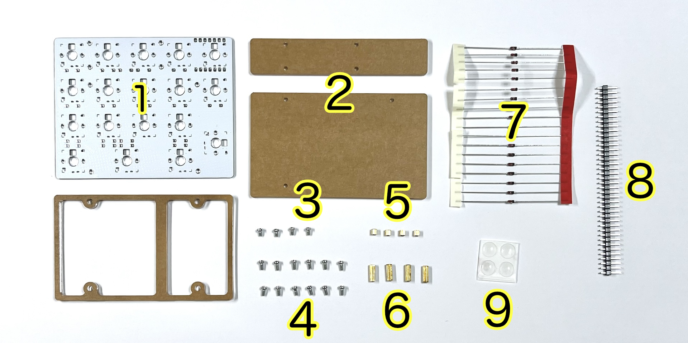
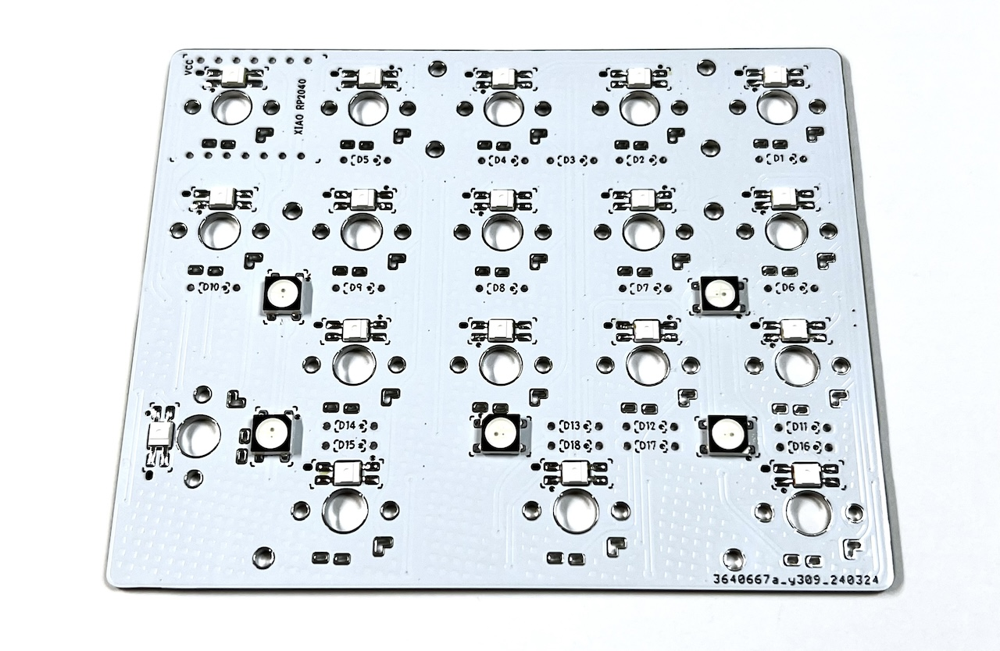

# Armors キーパッド

## キット内容
  
||部品名|数|
|-|-|-|
|1|メインボード|1|
|2|アクリルプレート|3|
|3|ネジ（短）|6|
|4|ネジ（中）|12|
|5|スペーサー（短）|6|
|6|スペーサー（長）|4|
|7|ダイオード|17|
|8|ピンヘッダー|1|
|9|ゴム足|4|

## キット以外に必要なもの
  
|部品名|数||
|-|-|-|
|XIAO RP2040|1||
|キースイッチ|17|Kailh/Lofree/Gateron ロープロファイル|
|キーキャップ|17|スイッチに対応したもの|
|USB ケーブル|1||

### （オプション）LED
|部品名|数|
|-|-|
|WS2812B|3|
|SK6812MINI-E|17|

## はんだ付け
### （オプション）LEDのはんだ付け
LEDには向きがあります。LED本体や足の切れ込みと基板のマークを合わせてメインボード裏面にはんだ付けします。   
  
  

### ダイオードのはんだ付け
ダイオードには向きがあります。ダイオードの線とメインボードのマークを合わせます。  
  

足を曲げてメインボード裏面から差し込み、表面ではんだ付けします。  
  

### ピンヘッダーのはんだ付け
7ピン分を二つ切り出します。  
  

メインボード裏面から短い方の足を差し込み表面ではんだ付けします。長い方の足を差し込んだ場合ははんだ付けした所を切り短くします。  
  

### キースイッチのはんだ付け
メインボード表面から差し込み裏面ではんだ付けします。  
  

### XIAO RP2040のはんだ付け
BOOTボタンを押しながらPCに接続し、少し待ってから指を離すとRPI-RP2というドライブとして認識されます。  
  

こちらのuf2ファイルをダウンロードしてください。  
- [tarohayashi_armors_v2_default.uf2](https://github.com/Taro-Hayashi/Armors-v2/releases/latest/download/tarohayashi_armors_v2_default.uf2)

RPI-RP2ドライブにダウンロードしたuf2ファイルをドラッグアンドドロップして、ドライブが消えたことを確認します。  

XIAO RP2040とメインボードのVCCの位置に注意しながらピンヘッダに差し込みはんだ付けして足を切ります。  

### 動作確認
PCに接続してキーを押し、アルファベットが入力されることを確かめてください。  
  

## 組み立て
メインボード下側の6箇所のネジ穴にスペーサー（短）をねじ（短）で止め、穴の空いているアクリルプレートをはめ込みます。  
  

サイズの合うアクリルプレートをねじ（中）で止めます。  

  

残りの4箇所のネジ穴にスペーサー（長）をねじ（中）で止めます。  
  

サイズの合うアクリルプレートをねじ（中）で止めてゴム足を貼ります。  
  

キーキャップを取り付けます。
  

## キーのカスタマイズ
XIAO RP2040に重なっているキーを押しながらPCと接続し、1秒以上待ってキーから指を離すとRPI_RP2ドライブとして認識されます。  
  

※認識されない場合はXIAO RP2040のBOOTボタンを押しながら接続してください。  

こちらのuf2ファイルをダウンロードしてください。
- [tarohayashi_armors_v2_vial.uf2](https://github.com/Taro-Hayashi/Armors-v2/releases/latest/download/tarohayashi_armors_v2_vial.uf2)

RPI-RP2ドライブにダウンロードしたuf2ファイルをドラッグアンドドロップして、ドライブが消えたことを確認します。  

VIALに接続し自由にキーを入れ替えてお使いください。  
- https://vial.rocks

  

## その他
### Remap用ファームウェア
- [tarohayashi_armors_v2_via.uf2](https://github.com/Taro-Hayashi/Armors-v2/releases/latest/download/tarohayashi_armors_v2_via.uf2)

### ファームウェアのコード
- vial-qmk https://github.com/Taro-Hayashi/vial-qmk/tree/tarohayashi/keyboards/tarohayashi/armors_v2
- qmk-firmware https://github.com/Taro-Hayashi/qmk_firmware/tree/tarohayashi/keyboards/tarohayashi/armors_v2

### zmk-config
- https://github.com/Taro-Hayashi/zmk-config-th/tree/armors

### 販売サイト
BOOTH: https://tarohayashi.booth.pm/items/3154455
